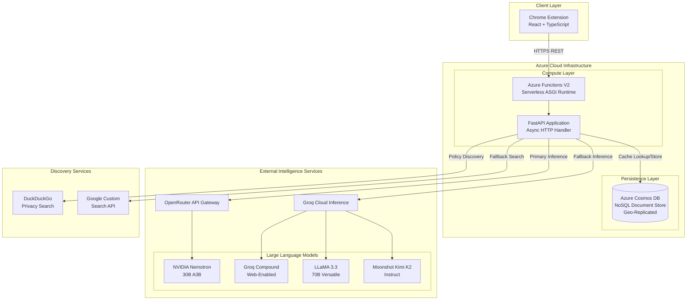
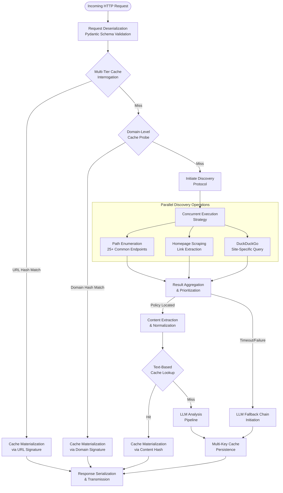
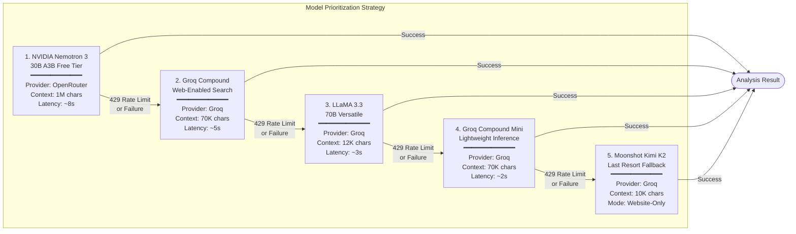
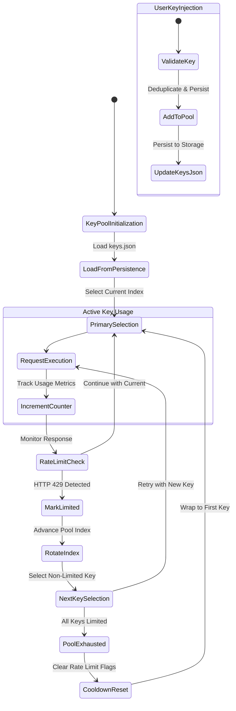
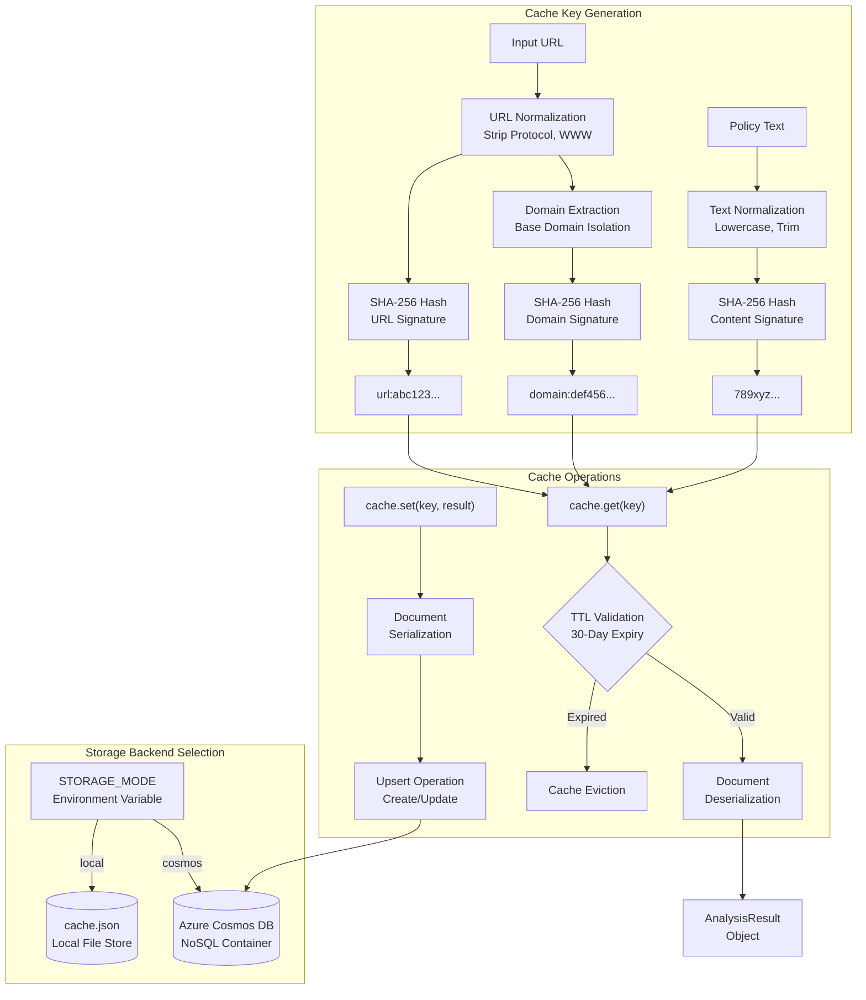
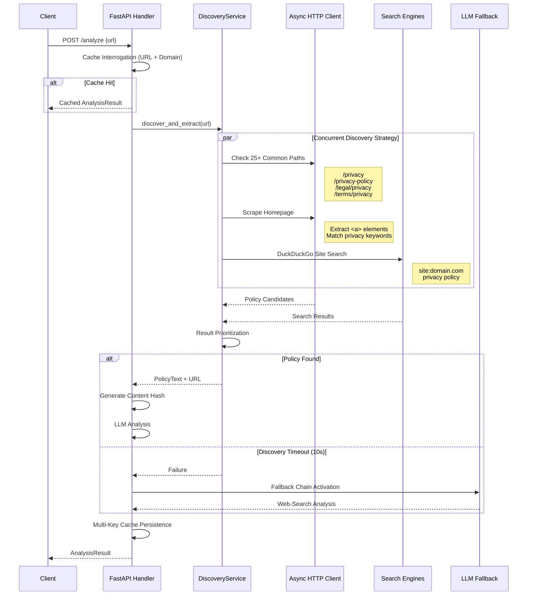
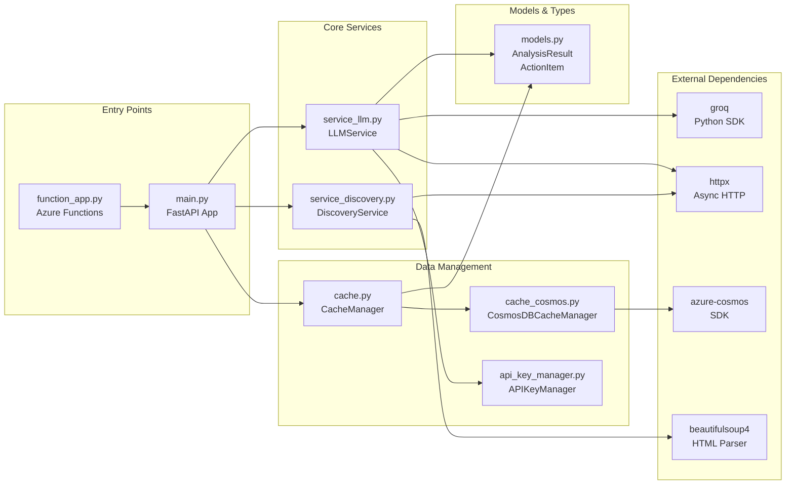
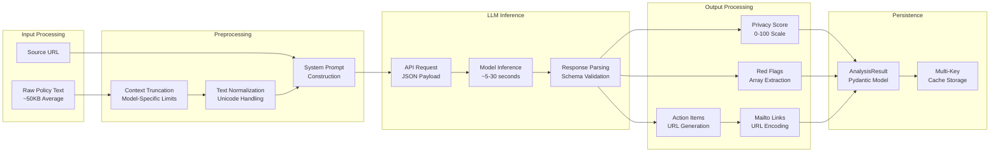

# Hercule Backend Architecture & System Flows

A comprehensive technical documentation of the Hercule Privacy Policy Analyzer's distributed backend infrastructure.

---

## 1. High-Level System Architecture

---

## 2. Request Processing Pipeline

---

## 3. LLM Fallback Chain Architecture

---

## 4. API Key Rotation & Management

---

## 5. Caching Strategy & Data Flow

---

## 6. Privacy Policy Discovery Protocol

---

## 7. Component Dependency Graph

---

## 8. Data Transformation Pipeline

---

## Technical Specifications

| Component | Technology | Specification |
|-----------|------------|---------------|
| **Runtime** | Azure Functions V2 | Python 3.11, ASGI |
| **Framework** | FastAPI | Async/Await, Pydantic |
| **Primary LLM** | NVIDIA Nemotron 3 | 30B parameters, 1M context |
| **Cache Backend** | Azure Cosmos DB | NoSQL, Serverless, Geo-distributed |
| **Hash Algorithm** | SHA-256 | 256-bit cryptographic digest |
| **TTL Policy** | 30 days | Configurable via CACHE_TTL_DAYS |
| **Concurrency** | asyncio | Non-blocking I/O operations |
| **Serialization** | JSON | Pydantic model_dump() |

---

*Generated for Hercule Privacy Policy Analyzer - Imagine Cup 2026*
