# Hercule Complete System Flow

```mermaid
flowchart TB
    %% ==================== CACHING LAYER ====================
    subgraph CACHE["🗄️ DISTRIBUTED CACHING LAYER - Azure Cosmos DB"]
        direction LR
        CACHE_URL["URL Hash Cache<br/>━━━━━━━━━━━━<br/>SHA-256 Signature"]
        CACHE_DOMAIN["Domain Hash Cache<br/>━━━━━━━━━━━━<br/>Base Domain Match"]
        CACHE_TEXT["Content Hash Cache<br/>━━━━━━━━━━━━<br/>Policy Text Hash"]
        
        CACHE_URL -.->|"Miss"| CACHE_DOMAIN
        CACHE_DOMAIN -.->|"Miss"| CACHE_TEXT
        CACHE_TEXT -.->|"Miss"| DISCOVERY_START
    end

    %% ==================== INPUT ====================
    CLIENT["🌐 Chrome Extension<br/>User visits website"]
    CLIENT -->|"POST /analyze"| CACHE

    %% ==================== CACHE HIT PATH ====================
    CACHE_URL -->|"✅ HIT ~0.3s"| RESPONSE
    CACHE_DOMAIN -->|"✅ HIT ~0.3s"| RESPONSE
    CACHE_TEXT -->|"✅ HIT ~0.3s"| RESPONSE

    %% ==================== DISCOVERY LAYER ====================
    DISCOVERY_START(["⚡ CACHE MISS - Initiate Discovery"])
    
    subgraph COMMON_PATHS["📂 TIER 1: Common Path Enumeration (Concurrent - 10 URLs)"]
        direction LR
        P1["/privacy"]
        P2["/privacy-policy"]
        P3["/legal/privacy"]
        P4["/about/privacy"]
        P5["/policies/privacy"]
        P6["/terms/privacy"]
        P7["/privacy.html"]
        P8["/data-privacy"]
        P9["/legal/privacy-policy"]
        P10["/privacypolicy"]
    end

    DISCOVERY_START --> COMMON_PATHS
    
    P1 --> PATH_CHECK{"Any URL<br/>Returns 200?"}
    P2 --> PATH_CHECK
    P3 --> PATH_CHECK
    P4 --> PATH_CHECK
    P5 --> PATH_CHECK
    P6 --> PATH_CHECK
    P7 --> PATH_CHECK
    P8 --> PATH_CHECK
    P9 --> PATH_CHECK
    P10 --> PATH_CHECK

    PATH_CHECK -->|"✅ Found"| EXTRACT_TEXT
    PATH_CHECK -->|"❌ All 404"| SCRAPE_MAIN

    %% ==================== HOMEPAGE SCRAPING ====================
    subgraph SCRAPE_MAIN["🔍 TIER 2: Homepage Anchor Tag Extraction"]
        direction TB
        FETCH_HTML["Fetch Main Page HTML<br/>https://example.com"]
        PARSE_DOM["Parse DOM with BeautifulSoup4"]
        FIND_ANCHORS["Extract All Anchor Tags<br/>document.querySelectorAll('a')"]
        MATCH_KEYWORDS["Keyword Matching:<br/>privacy, policy, legal, terms,<br/>data protection, GDPR, CCPA"]
        EXTRACT_HREF["Extract href Attribute<br/>→ Privacy Policy URL"]
        
        FETCH_HTML --> PARSE_DOM
        PARSE_DOM --> FIND_ANCHORS
        FIND_ANCHORS --> MATCH_KEYWORDS
        MATCH_KEYWORDS --> EXTRACT_HREF
    end

    EXTRACT_HREF -->|"✅ URL Found"| SCAN_POLICY
    EXTRACT_HREF -->|"❌ No Match"| SEARCH_FALLBACK

    subgraph SCAN_POLICY["📄 Scan Discovered Policy URL"]
        FETCH_POLICY["HTTP GET Policy Page"]
        EXTRACT_CONTENT["Extract Text Content<br/>Remove HTML Tags"]
        NORMALIZE["Normalize & Clean Text"]
        
        FETCH_POLICY --> EXTRACT_CONTENT
        EXTRACT_CONTENT --> NORMALIZE
    end

    NORMALIZE --> EXTRACT_TEXT

    %% ==================== SEARCH FALLBACK ====================
    subgraph SEARCH_FALLBACK["🔎 TIER 3: Search Engine Fallback"]
        DDG["DuckDuckGo API<br/>site:domain.com privacy policy"]
        GOOGLE["Google Custom Search<br/>Fallback API"]
        
        DDG -->|"Timeout"| GOOGLE
    end

    SEARCH_FALLBACK -->|"✅ Found"| EXTRACT_TEXT
    SEARCH_FALLBACK -->|"❌ Timeout 10s"| AI_FALLBACK

    %% ==================== TEXT EXTRACTION ====================
    EXTRACT_TEXT["📜 Policy Text Extracted<br/>~50,000 characters"]
    EXTRACT_TEXT --> AI_AGENTS

    %% ==================== AI AGENTS LAYER ====================
    subgraph AI_AGENTS["🤖 MULTI-AGENT LLM INFERENCE PIPELINE"]
        direction TB
        
        subgraph AGENTS_WEB["Agents WITH Web Search Tools"]
            AGENT1["🌐 Groq Compound Agent<br/>━━━━━━━━━━━━━━━━━━<br/>Native Web Search<br/>Document Fetching<br/>Context: 70K tokens"]
            AGENT2["🌐 Groq Compound Mini<br/>━━━━━━━━━━━━━━━━━━<br/>Lightweight Web Search<br/>Fast Inference"]
        end
        
        subgraph AGENTS_DOC["Agents WITH Document Processing"]
            AGENT3["📄 NVIDIA Nemotron 3<br/>━━━━━━━━━━━━━━━━━━<br/>30B Parameters<br/>1M Token Context<br/>Full Policy Analysis"]
            AGENT4["📄 LLaMA 3.3 70B<br/>━━━━━━━━━━━━━━━━━━<br/>Versatile Model<br/>12K Token Context<br/>Chunked Processing"]
        end
        
        subgraph AGENTS_LAST["Last Resort Agent"]
            AGENT5["⚠️ Moonshot Kimi K2<br/>━━━━━━━━━━━━━━━━━━<br/>Website Name Only<br/>No Policy Text<br/>Knowledge-Based"]
        end
    end

    AI_FALLBACK["🚨 Discovery Failed<br/>Activate Web Agents"]
    AI_FALLBACK --> AGENT1
    AGENT1 -->|"429 Rate Limit"| AGENT2
    AGENT2 -->|"Failure"| AGENT5

    EXTRACT_TEXT --> AGENT3
    AGENT3 -->|"429 Rate Limit"| AGENT4
    AGENT4 -->|"Failure"| AGENT1

    AGENT1 -->|"✅ Success"| RESULT
    AGENT2 -->|"✅ Success"| RESULT
    AGENT3 -->|"✅ Success"| RESULT
    AGENT4 -->|"✅ Success"| RESULT
    AGENT5 -->|"✅ Success"| RESULT

    %% ==================== AZURE FUNCTIONS ====================
    subgraph AZURE["☁️ AZURE FUNCTIONS - Serverless Compute"]
        direction TB
        RESULT["📊 Analysis Result Generated<br/>━━━━━━━━━━━━━━━━━━<br/>• Privacy Score: 0-100<br/>• Red Flags Array<br/>• Action Items<br/>• Mailto Links"]
        
        PERSIST["💾 Persist to Cache<br/>━━━━━━━━━━━━━━━━━━<br/>• URL Hash Key<br/>• Domain Hash Key<br/>• Content Hash Key"]
        
        SERIALIZE["📦 JSON Serialization<br/>Pydantic Model Export"]
        
        RESULT --> PERSIST
        PERSIST --> SERIALIZE
    end

    %% ==================== RESPONSE ====================
    SERIALIZE --> RESPONSE
    
    RESPONSE["🚀 HTTP Response to Client<br/>━━━━━━━━━━━━━━━━━━<br/>AnalysisResult JSON<br/>~2KB Payload"]
    
    RESPONSE --> FRONTEND

    subgraph FRONTEND["📱 Chrome Extension UI"]
        RENDER["Render Privacy Score<br/>Display Red Flags<br/>Show Action Items<br/>Generate Email Links"]
    end

    %% ==================== STYLING ====================
    style CACHE fill:#1a365d,stroke:#3182ce,stroke-width:3px,color:#fff
    style COMMON_PATHS fill:#744210,stroke:#d69e2e,stroke-width:2px,color:#fff
    style SCRAPE_MAIN fill:#2f4f2f,stroke:#48bb78,stroke-width:2px,color:#fff
    style SEARCH_FALLBACK fill:#4a235a,stroke:#9b59b6,stroke-width:2px,color:#fff
    style AI_AGENTS fill:#1a1a2e,stroke:#e94560,stroke-width:3px,color:#fff
    style AZURE fill:#0078d4,stroke:#50e6ff,stroke-width:3px,color:#fff
    style FRONTEND fill:#2d3748,stroke:#38b2ac,stroke-width:2px,color:#fff
    style RESPONSE fill:#22543d,stroke:#68d391,stroke-width:3px,color:#fff
```

---

## Diagram Legend

| Layer | Purpose | Fallback |
|-------|---------|----------|
| **Caching** | Instant response if cached | → Discovery |
| **Tier 1** | Check 10 common URLs | → Tier 2 |
| **Tier 2** | Scrape homepage for links | → Tier 3 |
| **Tier 3** | Search engines | → AI Agents |
| **AI Agents** | Analyze policy text | Cascading fallback |
| **Azure Functions** | Process & respond | N/A |
